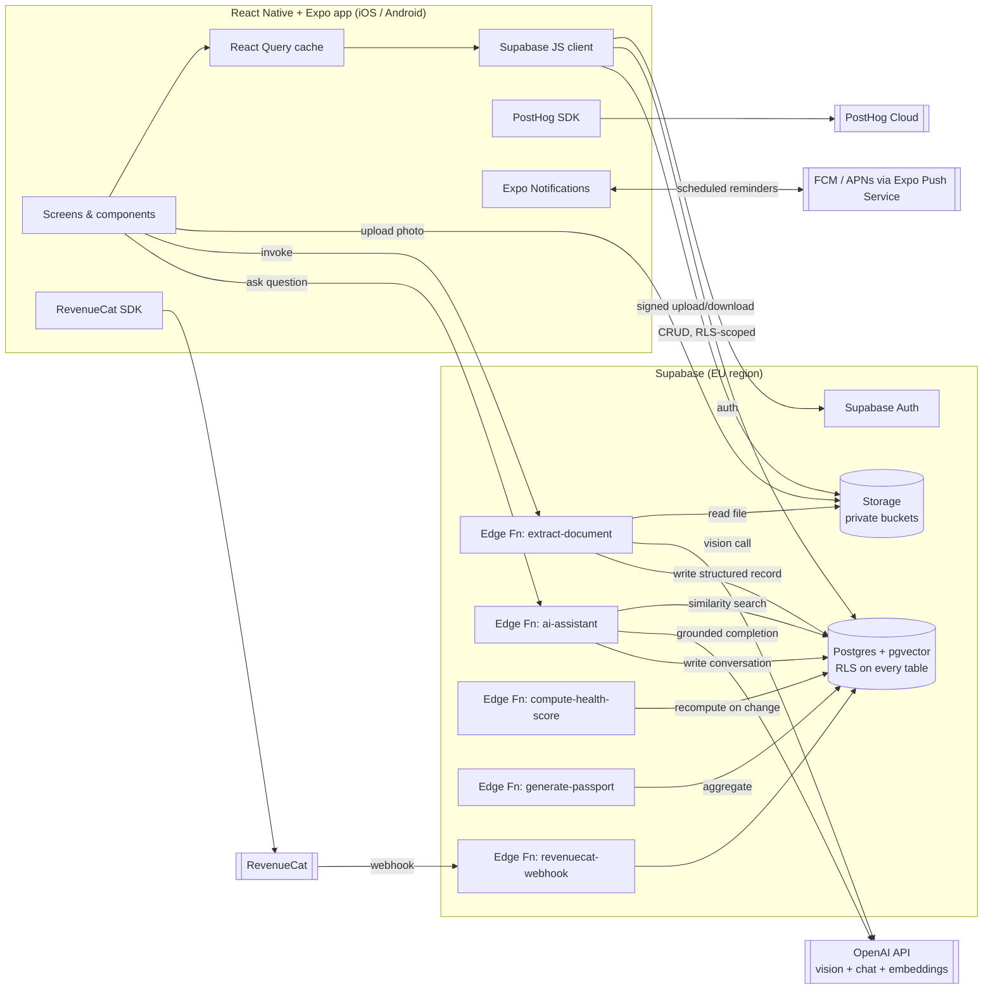

# Home Memory — Architecture

## 1. System overview



**Key decision: all OpenAI calls happen server-side (Edge Functions), never
from the client.** The OpenAI API key must never ship in the app bundle;
Edge Functions also let us enforce quota/entitlement checks (free vs
premium) in one place instead of trusting the client.

## 2. Mobile app

- **Framework**: Expo (managed workflow) + React Native + TypeScript,
  `expo-router` for file-based navigation. Managed workflow is sufficient —
  camera, document picker, notifications, and RevenueCat all ship as Expo
  config plugins; no ejection required (see risk T9).
- **Navigation**: bottom tabs exactly as specified — Home, Ask AI,
  Timeline, Documents, Profile — with stack navigators nested per tab for
  drill-down (property → room → asset → document).
- **Server state**: TanStack Query, backed directly by the Supabase JS
  client. Supabase realtime is used sparingly (e.g. live-updating a
  document's `extraction_status` while the Edge Function processes it) —
  not a general realtime sync layer.
- **Client state**: Zustand for local-only UI state (onboarding progress,
  camera queue, active property selection). No Redux — the app's state is
  overwhelmingly server state.
- **Offline capture**: photos are written to local file storage and an
  outbox table (via a small SQLite/AsyncStorage-backed queue) the instant
  they're taken; a background task uploads and triggers extraction when
  connectivity allows. The capture UI never blocks on network (risk T6).
- **Design system**: a small token set (colour, type scale, spacing,
  radius) plus a limited primitive library (Card, ListRow, Badge,
  EmptyState, Sheet). Visual direction: light, generous whitespace, one
  accent colour, restrained iconography — closer to Apple Health/Wallet
  than an enterprise dashboard. Built in Phase 1 alongside navigation.

## 3. Backend (Supabase)

- **Auth**: Supabase Auth (email/password + Apple/Google OAuth, required
  for App Store review parity — Sign in with Apple is mandatory if any
  other third-party login is offered).
- **Database**: Postgres with `pgvector` for embeddings and Row Level
  Security enabled on every table. See `03-database-schema.md`.
- **Storage**: two private buckets — `property-photos` (room/asset photos)
  and `documents` (receipts/manuals/certificates). Access exclusively via
  short-lived signed URLs generated server-side after an RLS-equivalent
  ownership check; buckets are never public.
- **Edge Functions** (Deno, TypeScript — shared language with the app):
  - `extract-document` — downloads an uploaded photo, calls OpenAI vision
    with a JSON schema for the target document/asset type, writes the
    result as `needs_review`, generates and stores an embedding.
  - `ai-assistant` — embeds the user's question, runs a pgvector
    similarity search scoped to the caller's accessible properties, calls
    OpenAI chat completion with a strict "answer only from context, cite
    sources, say you don't know otherwise" system prompt, persists the
    conversation turn with citations.
  - `compute-health-score` — recalculates a property's Home Health Score
    on relevant writes (document added, maintenance completed/overdue,
    warranty expired).
  - `generate-passport` — aggregates a property's full record into a
    versioned snapshot behind a signed, expiring share token.
  - `revenuecat-webhook` — verifies and applies RevenueCat subscription
    events to the `subscriptions` table; this table is the single source
    of truth for entitlement checks in every other Edge Function.
- **Scheduled jobs**: Supabase's `pg_cron` triggers a daily function that
  scans `maintenance_tasks` for items due soon/overdue and enqueues push
  notifications — the maintenance/reminder engine does not depend on the
  app being open.

## 4. AI integration

| Use case | Model class | Notes |
|---|---|---|
| Document/label vision extraction | Vision-capable chat model, structured JSON output | Cheapest tier that reliably handles structured extraction; escalate to a stronger model only on repeated low-confidence results. |
| AI assistant answers | Chat model, larger context | Higher quality justified — this is a premium, low-volume-per-user feature. |
| Embeddings | `text-embedding-3-small` (1536-dim) | Cheap, sufficient for a small per-property corpus; stored in `pgvector`. |

Model identifiers are intentionally not pinned in this doc — they're a
config value set at implementation time and revisited as OpenAI ships new
model versions.

## 5. Payments

- **RevenueCat** SDK in-app for purchase flow (handles App
  Store/Play Store IAP compliance automatically).
- RevenueCat is the purchase system of record; Supabase's
  `subscriptions` table is the **entitlement** system of record, kept in
  sync via the `revenuecat-webhook` Edge Function. Server-side entitlement
  checks (e.g. "is this household allowed another AI assistant call this
  month") read from Supabase, never from client-reported RevenueCat state.

## 6. Notifications

- **Decision**: use Expo's push notification service (`expo-notifications`)
  rather than integrating the raw Firebase Admin SDK directly. Expo's
  service delivers to FCM on Android and APNs on iOS under a single API,
  which satisfies the "FCM for Android" requirement while giving us one
  code path for both platforms and Expo config-plugin support with no
  ejection. Revisit only if a feature needs a Firebase-specific capability
  Expo's service doesn't expose (none identified today).

## 7. Analytics

- **PostHog** (EU cloud instance) via `posthog-react-native`, autocapture
  off — we track a deliberately small set of lifecycle events (signup,
  first asset created, first document scanned, reminder completed, AI
  question asked, upgrade) rather than generic screen-view noise. This
  keeps analytics aligned with the activation/retention risks in
  `01-product-analysis-and-risks.md` instead of vanity metrics.

## 8. Security & compliance posture

- RLS on every table; no table is ever queried with the Supabase service
  role from client-reachable code.
- Storage buckets private; all file access via signed URLs with short
  expiry.
- Household-scoped access model (see schema) underpins both family
  sharing and data isolation — the same mechanism does both jobs.
- GDPR: EU-region Supabase project; account deletion is a single cascading
  operation (documented and tested, not just implemented as `ON DELETE
  CASCADE` in the schema); data export produces a structured JSON/PDF of
  everything the schema stores for that household.
- Home Passport shares are token-based, expiring, and revocable — a buyer
  never gets standing access to the seller's account.

## 9. Repository layout (target, built out in Phase 1)

```
/app                      # expo-router routes (screens)
/src
  /components              # shared design-system primitives
  /features
    /auth
    /home                  # property/room/asset (Home Profile)
    /documents              # scanner + document list/detail
    /ai-assistant
    /timeline
    /maintenance
    /passport
    /subscription
  /lib                     # supabase client, query keys, notifications
  /hooks
  /store                   # zustand stores
  /types                   # generated Supabase types + domain types
/supabase
  /migrations               # SQL schema (see 03-database-schema.md)
  /functions                # Edge Functions
/docs
  /planning                 # this document set
```

## 10. Open decisions requiring your input before/at Phase 1

These are flagged rather than assumed, because they change downstream
work:

1. **Household model at signup** — proposal: every signup auto-creates a
   personal single-member "household" so the sharing model has no special
   case later (a personal account is just a household of one). Confirm
   this is acceptable rather than a simpler "properties belong directly to
   a user" model that would need a breaking migration to add sharing
   later.
2. **Supabase project region** — proposing EU (Ireland) for UK-first + GDPR
   alignment.
3. **OpenAI model choice** — to be pinned once you confirm current
   OpenAI account access/tier; affects per-scan cost assumptions in the
   free-tier limits.
