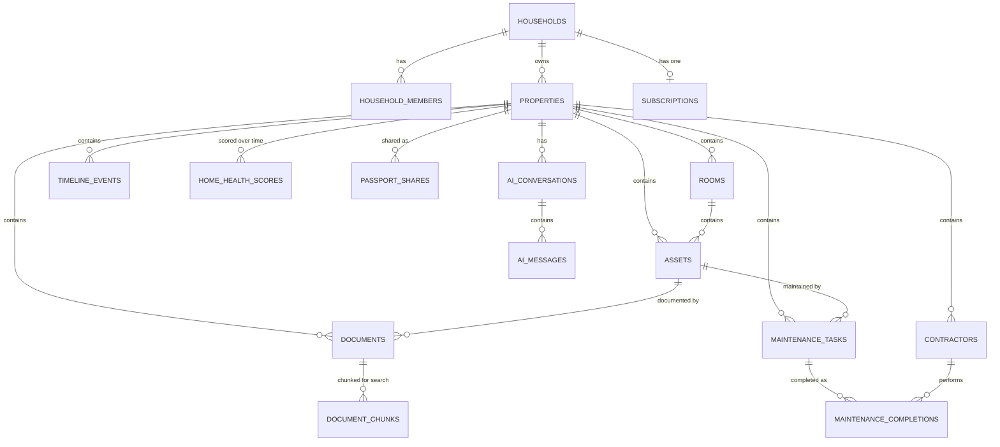

# Home Memory — Database Schema

Full DDL lives in `supabase/migrations/`. This document explains the
modelling decisions; read alongside the SQL.

## 1. Entity overview

## 2. Key modelling decisions

- **Household is the sharing/tenancy boundary, not the user.** Every
  property belongs to a household; every user belongs to at least one
  household (their personal one, auto-created at signup). Family Sharing
  (premium) is then just "invite another user into this household" — no
  schema change needed when that feature ships in Phase 4. This is the
  single open decision flagged in `02-architecture.md` §10.
- **Assets use a fixed core + `attributes jsonb`.** Appliances/fixtures
  vary too much for a rigid column-per-field schema (a boiler and a patio
  don't share fields). Common fields (brand, model, serial number,
  purchase date, warranty expiry) are real columns because they're
  queried/filtered/reminded-on directly; everything else extracted by AI
  goes into `attributes jsonb`.
- **Documents are extraction-status-tracked, never silently trusted.**
  `extraction_status` starts at `pending`/`processing`/`needs_review` and
  only becomes `completed` after user confirmation, per risk P4/T1. The
  raw AI output is kept in `ai_extracted jsonb` even after the user edits
  the structured fields, for debugging/quality review.
- **Two-level search**: `documents.ocr_text` is chunked into
  `document_chunks` (each with its own embedding) so the AI assistant can
  retrieve the specific passage that answers a question, not just "this
  document is relevant." `assets` also carries its own `embedding` for
  short-form semantic search ("what's in my kitchen") without going
  through the chunk table.
- **Timeline events reference other rows rather than duplicating data.**
  A timeline entry for "boiler installed" points at the `asset_id` and/or
  `document_id` it came from; the timeline is a read-oriented view over
  the same underlying facts, not a separate data-entry surface.
- **RevenueCat is a system of record we mirror, not one we trust
  client-side.** `subscriptions` is written only by the
  `revenuecat-webhook` Edge Function (service role), never by the client.
- **Everything cascades from `households`.** Deleting a household deletes
  every property and everything under it, and (Storage objects are
  deleted by the application-level deletion routine, not by SQL cascade,
  since Postgres cascade can't reach Storage). This makes GDPR "delete my
  data" a single, testable operation rooted at one table.

## 3. RLS strategy

- RLS is **on** for every table from the first migration — there is no
  "add security later" step.
- Two `security definer` helper functions avoid the classic recursive-RLS
  trap on `household_members`:
  - `is_household_member(household_id uuid) returns boolean`
  - `can_access_property(property_id uuid) returns boolean` (joins
    `properties → household_members` for the calling user)
- Every property-scoped table's policies are expressed as
  `can_access_property(property_id)` for `SELECT`/`INSERT`/`UPDATE`, so
  the access rule lives in one place and every new table reuses it instead
  of re-deriving household membership.
- Destructive actions (deleting a property, removing a household member)
  are additionally restricted to the household `owner` role.

## 4. Migration files

1. `20260806000001_extensions_and_enums.sql` — `pgcrypto`, `vector`
   extensions; enum types.
2. `20260806000002_core_schema.sql` — all tables, indexes, foreign keys.
3. `20260806000003_functions_and_triggers.sql` — `updated_at` trigger,
   new-user provisioning (personal household), RLS helper functions.
4. `20260806000004_rls_policies.sql` — RLS enablement + policies for every
   table.

These will be validated against the Supabase local dev stack (`supabase
db reset` + a seed script) as the first task of Phase 1, alongside
generated TypeScript types (`supabase gen types typescript`).
